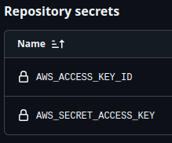

# Demo App 1 - Todos

This is a simple "TODO" API that allows users to create, read, update, and delete tasks.
it is complete with authentication and authorization.
You can create an account, log in, and create tasks that are only visible to you.

---

## Usage

To run this app from your own repo, follow the instructions below:
1. Create an AWS account
2. Create an IAM user and create credentials.
3. Add those credentials to Github under the secrets section.





4. Run the `Manual API Deploy` Github Action.

This will create the necessary infrastructure on AWS, build the Docker image, and deploy the app to AWS.

To destroy the infrastructure, make sure you have `cdk` install by running `npm i -g cdk` and AWS credentials configured in your environment. Then run the following command:

```bash
cdk destroy
```


## Notes for Potential Employers / Recruiters

This app is for demonstration purposes only.
It is a project I've created to demonstrate different development principles and techniques.
If you're a potential employer or recruiter, please take note of the following:

1. - [X] Pydantic Data Modeling and Validation
2. - [X] Use of Dyntastic for DynamoDB integration
3. - [X] Sane git repository:
   * - [X] Proper commit messages
   * - [X] Proper branching
   * - [X] Proper documentation
   * - [X] Proper `.gitignore`
   * - [X] Proper branch protections
4. - [X] Use of GitHub Actions for CI/CD
   * - [X] Linting
   * - [X] Testing
   * - [X] Formatting
   * - [X] Deployment
5. - [X] Use of AWS Services:
   * - [X]  Cognito
   * - [X]  DynamoDB
   * - [X]  Lambda
   * - [X]  API Gateway
6. - [X] IaC via CDK:
   * - [X]  Cognito
   * - [X]  DynamoDB
   * - [X]  Lambda
   * - [X]  API Gateway
7. - [X] Docker
8. - [X] Documentation
